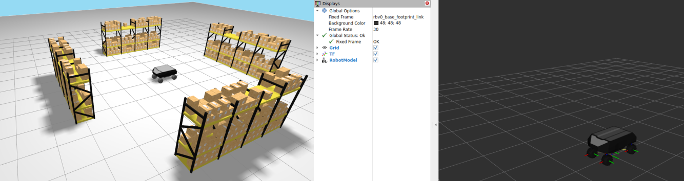

# robot_rbvogui_common

`robot_rbvogui_common` represents the RB-VOGUI robot base model. Although the base on its own may have limited practical use, this package provides the common foundation that other more fully equipped RB-VOGUI robot models use as a dependency.


> **Note:** The figure does not show every frame included in the base model.

This package is strongly inspired by Robotnik's ROS 2 repositories:
[`robotnik_description`](https://github.com/RobotnikAutomation/robotnik_description),
[`robotnik_sensors`](https://github.com/RobotnikAutomation/robotnik_sensors),
[`robotnik_simulation`](https://github.com/RobotnikAutomation/robotnik_simulation),
[`robotnik_common`](https://github.com/RobotnikAutomation/robotnik_common),
[`robotnik_gazebo_models`](https://github.com/RobotnikAutomation/robotnik_gazebo_models), and
[`robotnik_gazebo_worlds`](https://github.com/RobotnikAutomation/robotnik_gazebo_worlds).

The package can be understood as a reworking of functionality found in those repositories, with an organization I find more intuitive and easier to integrate into a project. This is an opinionated design choice; users should judge for themselves whether it suits their needs.

## Resources

### Base model `urdf/common.xacro`

[`common.xacro`](urdf/common.xacro) defines the RB-VOGUI mobile base, consisting of its body and four steerable wheels. Derived robot models include this file to reuse the base before adding their own equipment.

The package provides two default configuration files; [`config/default_xacro_args.yaml`](config/default_xacro_args.yaml) and [`config/default_simulation.yaml`](config/default_simulation.yaml). They are examples and guides that users can adapt to customize the base model and its simulated behavior.

Derived packages can define their own default Xacro-arguments and simulation files. For their simulation file, they should preserve the settings required by the common base plugins and add the configuration for the plugins they own.

[`config/default_xacro_args.yaml`](config/default_xacro_args.yaml) lists the Xacro arguments and their default values for the common base model. A derived package should provide its own Xacro-arguments file. It should retain the base arguments it uses, set their values as needed, and add the arguments declared by its own model. Use that file when rendering the derived model.

`common.xacro` also accepts a simulation YAML file through its `sim_file` argument.
[`config/default_simulation.yaml`](config/default_simulation.yaml) lists the configuration entries for the Gazebo plugins used by the common base model. It is the starting point for a derived model. Its simulation file should retain the entries required by the common base and add entries for every plugin declared by the derived model, such as sensors or actuators.

The package also provides common meshes. These include the base meshes and additional meshes that derived models may use, such as the basket meshes.

### Launch files

A derived model package can reuse the following launch files instead of implementing them again. Each launch file receives that model's files and robot name as launch arguments.

- [`launch/render_robot_urdf.launch.py`](launch/render_robot_urdf.launch.py) renders a model's Xacro file into a URDF file. A derived package uses it with its own Xacro entry point, Xacro-arguments file, simulation file, and destination URDF path.
- [`launch/robot_state_publisher.launch.py`](launch/robot_state_publisher.launch.py) starts `robot_state_publisher` from a URDF file generated by `render_robot_urdf.launch.py` and a ROS parameter file. A derived package can reuse it after rendering its own URDF, while supplying its own parameters.
- [`launch/bridge.launch.py`](launch/bridge.launch.py) starts the ROS-Gazebo bridge from a bridge configuration file and a ROS parameter file. The bridge configuration file defines which topics are exchanged between Gazebo and ROS 2. The base model and every derived model provide their own bridge configuration and parameter files for the interfaces used by that specific model.

  This launch file also creates the channel that forwards the battery state from Gazebo to ROS 2 as `main_battery/state`. The LinearBatteryPlugin uses a Gazebo topic name that includes the runtime model name. Unlike the ROS parameter YAML file, the bridge configuration YAML file is not processed by ROS 2 launch substitutions. It cannot insert the runtime model name into that topic. The launch file therefore creates the battery bridge in Python after it resolves the model name.
- [`launch/ground_vehicle_kinematics.launch.py`](launch/ground_vehicle_kinematics.launch.py) starts the four-steer ground-vehicle kinematics node using the RB-VOGUI namespace and frame conventions. A derived package can reuse it.

Each derived model provides the parameter file that configures the nodes started by these launch files. The base model provides [`config/default_params.yaml`](config/default_params.yaml) as an example.

## Installation

`robot_rbvogui_common` depends on ROS 2 packages available from the APT package repositories. Install those dependencies with `rosdep`. It also depends on packages that are not available from APT. Their source repositories are listed in [`deps.repos`](deps.repos).

```bash
export WORKSPACE=<path-to-your-workspace>
mkdir -p "${WORKSPACE}"
git clone https://github.com/jfrascon/robot_rbvogui_common.git "${WORKSPACE}/robot_rbvogui_common"
vcs import "${WORKSPACE}" < "${WORKSPACE}/robot_rbvogui_common/deps.repos"
source /opt/ros/jazzy/setup.bash
rosdep install --from-paths "${WORKSPACE}" --ignore-src -r -y
```

## Build

Build the package from the workspace root:

```bash
cd "${WORKSPACE}"
colcon build --merge-install --packages-select robot_rbvogui_common
source install/setup.bash
```

## Visualize the base model

The package includes a launch file and supporting resources to visualize the base model in Gazebo and RViz without adding it to a project. This visualization is illustrative only. It runs the model in a simple test world so that you can inspect it and receive test data from its embedded sensors when they are enabled in the simulation file.

The debug launch file is useful for quickly checking that the model still works after a change and for testing newly added sensors.

```bash
robot_rbvogui_common_share="$(ros2 pkg prefix robot_rbvogui_common)/share/robot_rbvogui_common"
"${robot_rbvogui_common_share}/scripts/debug_model_base.sh"
```

You can pass the script any argument accepted by `debug_model_base.launch.py`. To see the available arguments, run:

```bash
ros2 launch robot_rbvogui_common debug_model_base.launch.py --show-args
```

For example, run the simulation without the Gazebo GUI or RViz:

```bash
robot_rbvogui_common_share="$(ros2 pkg prefix robot_rbvogui_common)/share/robot_rbvogui_common"
"${robot_rbvogui_common_share}/scripts/debug_model_base.sh" \
  rviz_enabled:=False \
  gzgui_enabled:=False
```



> This image shows the base model simulation with the default values.

## Tests

Build and run the package tests from the workspace root:

```bash
cd "${WORKSPACE}"
colcon build --merge-install --packages-select robot_rbvogui_common
colcon test --merge-install --packages-select robot_rbvogui_common
colcon test-result --test-result-base build --verbose
```

### Inspect the generated URDF

You can also render the base model and validate the resulting URDF directly with `check_urdf`:

```bash
robot_rbvogui_common_share="$(ros2 pkg prefix robot_rbvogui_common)/share/robot_rbvogui_common"
ros2 launch robot_rbvogui_common render_robot_urdf.launch.py \
  robot_name:=rbv0 \
  robot_xacro_file:="${robot_rbvogui_common_share}/urdf/model_base.xacro" \
  robot_xacro_args_file:="${robot_rbvogui_common_share}/config/default_xacro_args.yaml" \
  robot_sim_file:="${robot_rbvogui_common_share}/config/default_simulation.yaml" \
  robot_urdf_file:=/tmp/rbvogui_base.urdf
check_urdf /tmp/rbvogui_base.urdf
```

## Derived model examples

The following packages build on `robot_rbvogui_common`:

- [robot_rbvogui_basket_layout_a](https://github.com/jfrascon/robot_rbvogui_basket_layout_a.git)
- [robot_rbvogui_forklift](https://github.com/jfrascon/robot_rbvogui_forklift.git)
