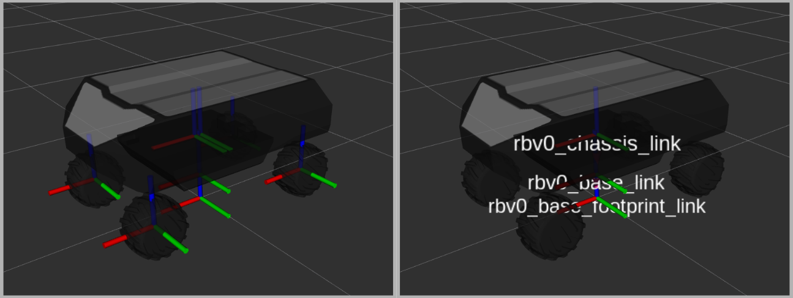

# robot_rbvogui_common

`robot_rbvogui_common` contains the shared RB-VOGUI base model and the launch
helpers used by RB-VOGUI variants.



This package owns the common mobile base resources:

- base Xacro model
- chassis and battery meshes
- base debug launch
- Gazebo debug world
- ROS-Gazebo bridge launch helper
- ground-vehicle kinematics launch helper
- robot_state_publisher launch helper

## Build

Build from the workspace root:

```bash
colcon build --merge-install --packages-select robot_rbvogui_common
source install/setup.bash
```

## Visualize the base model

Use the debug script to visualize the base model in Gazebo and RViz with the package defaults. This is only for visual inspection, without inserting the model in a project.

```bash
robot_rbvogui_common_share="$(ros2 pkg prefix robot_rbvogui_common)/share/robot_rbvogui_common"
"${robot_rbvogui_common_share}/scripts/debug_model_base.sh"
```

The script calls the debug launch file and passes the default files explicitly:

```bash
robot_rbvogui_common_share="$(ros2 pkg prefix robot_rbvogui_common)/share/robot_rbvogui_common"
config_share="${robot_rbvogui_common_share}/config"
ros2 launch robot_rbvogui_common debug_model_base.launch.py \
  robot_name:=rbv0 \
  robot_xacro_args_file:="${config_share}/default_xacro_args.yaml" \
  robot_sim_file:="${config_share}/default_simulation.yaml" \
  robot_bridge_config_file:="${config_share}/default_bridge.yaml" \
  robot_params_file:="${config_share}/default_params.yaml" \
  robot_params_file_allow_substs:=True \
  rviz_enabled:=True \
  gzgui_enabled:=True
```

To override one of those launch arguments, append it after the script command.
The extra arguments are forwarded to `ros2 launch` after the defaults.

```bash
robot_rbvogui_common_share="$(ros2 pkg prefix robot_rbvogui_common)/share/robot_rbvogui_common"
"${robot_rbvogui_common_share}/scripts/debug_model_base.sh" \
  rviz_enabled:=False \
  gzgui_enabled:=False
```

## Public launch files

- `launch/debug_model_base.launch.py`

This launch file uses these defaults:

- `config/default_params.yaml`
- `config/default_xacro_args.yaml`
- `config/default_simulation.yaml`
- `config/default_bridge.yaml`

## Internal launch helpers

These launch files are installed for reuse by robot variants:

- `launch/_bridge.launch.py`
- `launch/_ground_vehicle_kinematics.launch.py`
- `launch/_robot_state_publisher.launch.py`

Variant packages can reuse `_robot_state_publisher.launch.py` with:

- `robot_xacro_file`: path to the Xacro file that generates `robot_description`

Derived model packages should pass their own Xacro entry point:

```text
robot_xacro_file:=<share>/<derived_package>/urdf/<derived_model>.xacro
```

## Xacro resources

Shared include for RB-VOGUI base geometry:

```text
urdf/common.xacro
```

`common.xacro` defines the base frame tree, chassis, battery, wheels, shared Gazebo plugins, and shared Xacro arguments used by the base and by derived variants. Each derived variant defines its own Gazebo plugins for its specific sensors, actuators, and other model-specific components.

Common model entry point:

```text
urdf/model_base.xacro
```

## Configuration files

`debug_model_base.launch.py` receives one file for each configuration boundary:

```text
config/
|-- default_bridge.yaml
|-- default_params.yaml
|-- default_simulation.yaml
`-- default_xacro_args.yaml
```

Their purpose is:

- `default_xacro_args.yaml` is passed to `xacro` while generating `robot_description`. It configures the common base geometry, including the chassis and wheels.
- `default_simulation.yaml` is passed to the common Gazebo plugins declared by `common.xacro`. It configures the mobile-base simulation, such as wheel-joint controllers, friction, joint states, and the base pose publisher.
- `default_bridge.yaml` configures the ROS-Gazebo bridge for the common base interfaces: velocity commands, base pose, simulated TF, base joint commands, and joint states.
- `default_params.yaml` provides ROS parameters for the nodes launched with the model, including the state publisher, bridge, and ground-vehicle kinematics.

A derived model package should provide its own files for configuration that it owns, such as sensor and actuator plugins and their ROS-Gazebo bridges, while preserving the common base configuration required by this package.

Launch-time values such as `namespace`, `robot_name`, and file paths belong in the launch command, not in `default_xacro_args.yaml`.

## Debug Assets

```text
worlds/debug_world.sdf
worlds/debug_world_bridge.yaml
rviz/sim_debug.rviz
meshes/
```

Variant packages can use these assets instead of duplicating them.

## Validate

Build and run tests:

```bash
colcon build --merge-install --packages-select robot_rbvogui_common
colcon test --merge-install --packages-select robot_rbvogui_common
colcon test-result --test-result-base build --verbose
```

For direct Xacro inspection:

```bash
xacro $(ros2 pkg prefix robot_rbvogui_common)/share/robot_rbvogui_common/urdf/model_base.xacro \
  > /tmp/rbvogui_base.urdf
check_urdf /tmp/rbvogui_base.urdf
```
